# 🎮 ESP32-C3 SuperMini Multi-Game Handheld Console

[](https://www.espressif.com/)
[](https://www.arduino.cc/)
[](https://github.com/MRFIRE5673/ESP32-C3-Gamepad)
[](LICENSE)
[](#-games--controls-guide)

An ultra-compact, low-power handheld retro console built around the **ESP32-C3 SuperMini** (160MHz 32-bit RISC-V) and a 128&times;64 I2C OLED display. Features **9 classic retro games**, a GameCube-inspired 3D wireframe boot sequence, non-volatile persistent high-score and settings memory via NVS, low-power light sleep with 8-button instant GPIO wakeup, and an anti-powerbank auto-shutoff keep-alive pulse mechanism.

---

## 📸 Hardware Showcase

<div align="center">
  <table>
    <tr>
      <td align="center" width="50%">
        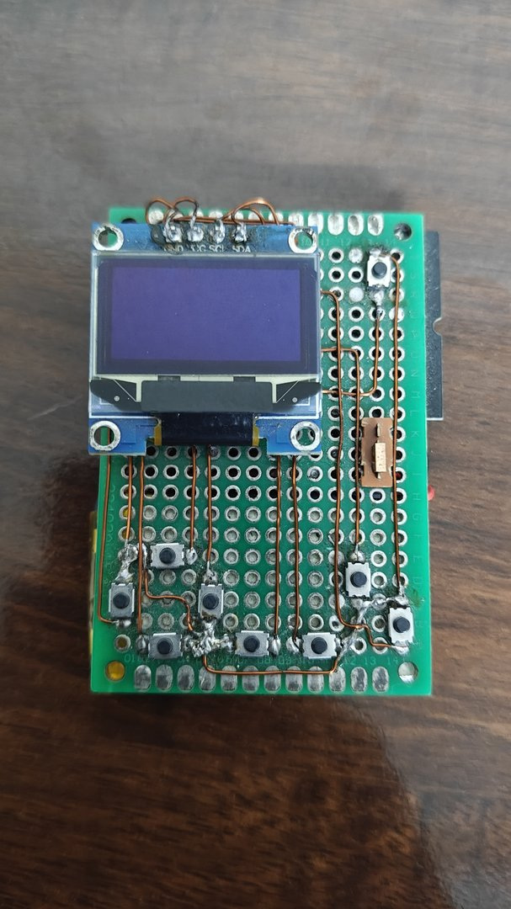<br>
        <b>Console Front</b><br>
        <i>Hand-wired perfboard with enamel copper traces, 0.96" I2C OLED, 8 tactile buttons & power switch.</i>
      </td>
      <td align="center" width="50%">
        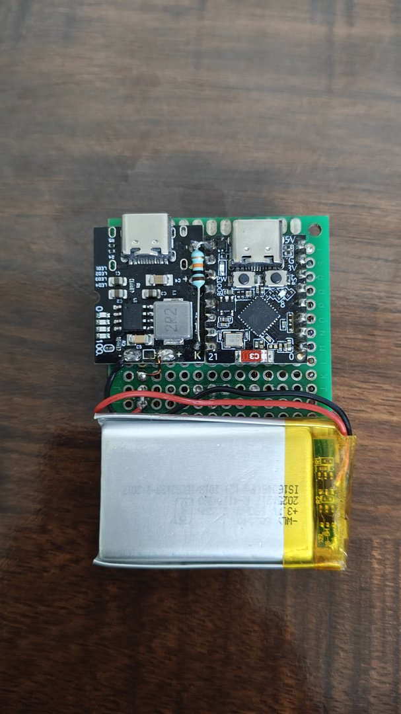<br>
        <b>Console Back</b><br>
        <i>ESP32-C3 SuperMini, TP4056 + 5V boost charger, keep-alive pulse resistor & 3.7V LiPo battery.</i>
      </td>
    </tr>
  </table>
</div>

---

## ✨ Key Features

- **9 Fully Playable Retro Games:**
  - 🧱 **Tetris:** 7-bag randomizer, rotation collision detection, ghost piece preview (toggleable), leveling drop speeds, line clears, and persistent high score.
  - 🐍 **Snake:** Smooth tick-rate movement, boundary and self-collision handling, food spawning, and high score tracking.
  - 🟡 **Pac-Man:** Maze navigation, ghost house, tunnels, power pellets, fright mode, and faithful 4-ghost AI personalities (Blinky, Pinky, Inky, Clyde).
  - 🏓 **Pong:** Single-player match against predictive tracking AI with configurable paddle speed and rally counter.
  - 🐦 **Flappy Bird:** Gravity physics, responsive flap velocity, procedural pipe obstacles, and collision hitboxes.
  - 💣 **Minesweeper:** 12&times;6 grid with cursor navigation, hidden mine generation, recursive zero-reveal, flag placement, and variable mine count (5–25).
  - 🧱 **Breakout:** Ball reflection physics, angle calculation based on paddle impact position, and 5-row brick grid.
  - 🚀 **Asteroids:** Vector-style spaceship with rotational physics, inertial thrust, wrap-around screen boundaries, projectile firing, and asteroid splitting.
  - 🔢 **2048:** 4&times;4 sliding grid with smooth tile merging, high-score tracking, and win detection.
- **🌀 3D Wireframe Boot Animation:** Real-time 3D rotation and projection of a spinning wireframe cube rendered directly on the SSD1306 OLED at boot.
- **💾 Persistent NVS Memory:** Saves brightness contrast, sleep timeout, Tetris ghost preview, Pac-Man ghost count, Pong AI speed, Minesweeper mine count, and per-game high scores to flash memory using ESP32 `Preferences.h`.
- **💤 Smart Light Sleep & 8-Button GPIO Wakeup:** Drops into ESP32 light sleep (`esp_light_sleep_start()`) when idle, shutting off display power. Instantly wakes up upon pressing any of the 8 buttons.
- **⚡ Anti-Power-Bank Auto-Shutoff Mechanism:** Periodically switches `GPIO 5` from floating high-impedance (`INPUT`) to `OUTPUT LOW` for 150ms every 20s through a load resistor. This draws a momentary current pulse, preventing smart power banks and charging boards from sleeping.
- **⏸️ Universal In-Game Pause Menu:** Pressing `SELECT` in any game freezes gameplay and opens an overlay menu with **Resume**, **Restart**, and **Quit to Main Menu**.

---

## 🕹️ Games & Controls Guide

All 8 buttons are active-low (`INPUT_PULLUP`). During gameplay, pressing `SELECT` pauses the game.

| Game | D-Pad (`UP` / `DOWN` / `LEFT` / `RIGHT`) | Button `A` | Button `B` | `START` | `SELECT` |
| :--- | :--- | :---: | :---: | :---: | :---: |
| **Tetris** | `LEFT`/`RIGHT`: Shift piece<br>`DOWN`: Soft drop | Rotate piece | Rotate piece | Hard drop / Restart (on Game Over) | Pause menu |
| **Snake** | Steer snake direction (Up / Down / Left / Right) | — | — | Restart (on Game Over) | Pause menu |
| **Pac-Man** | Steer Pac-Man (Up / Down / Left / Right) | — | — | Restart (on Game Over) | Pause menu |
| **Pong** | `UP` / `DOWN`: Move paddle | Serve ball | — | Restart (on Game Over) | Pause menu |
| **Flappy Bird** | — | Flap wings | Flap wings | Restart (on Game Over) | Pause menu |
| **Minesweeper** | Move grid cursor (Up / Down / Left / Right) | Reveal cell | Place / remove flag | Restart (on Game Over) | Pause menu |
| **Breakout** | `LEFT` / `RIGHT`: Move paddle | Launch ball | — | Restart (on Game Over) | Pause menu |
| **Asteroids** | `LEFT`/`RIGHT`: Rotate ship<br>`UP`: Thrust forward | Fire bullet | Fire bullet | Restart (on Game Over) | Pause menu |
| **2048** | Slide tiles (Up / Down / Left / Right) | — | — | Restart (on Game Over) | Pause menu |
| **Settings** | `UP`/`DOWN`: Select setting<br>`LEFT`/`RIGHT`: Adjust value | Confirm reset | — | Return to menu | Return to menu |

---

## 🖼️ In-Game Screenshot Gallery

<div align="center">
  <table>
    <tr>
      <td align="center">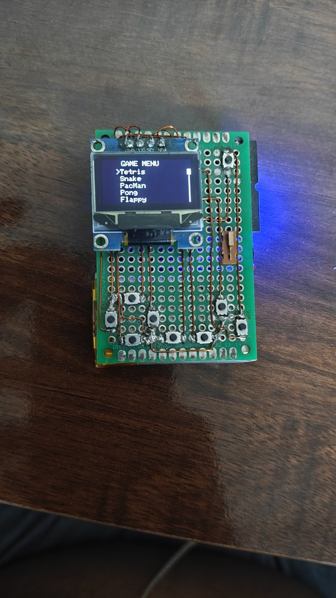<br><b>Game Menu</b></td>
      <td align="center">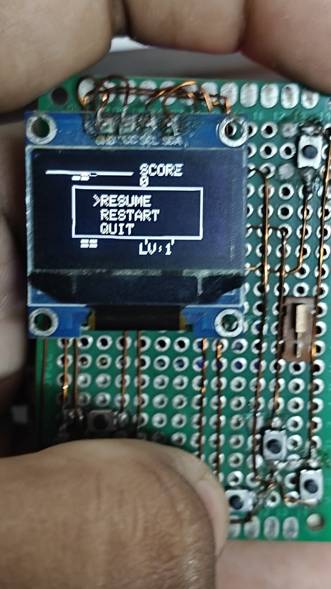<br><b>Pause Overlay</b></td>
      <td align="center">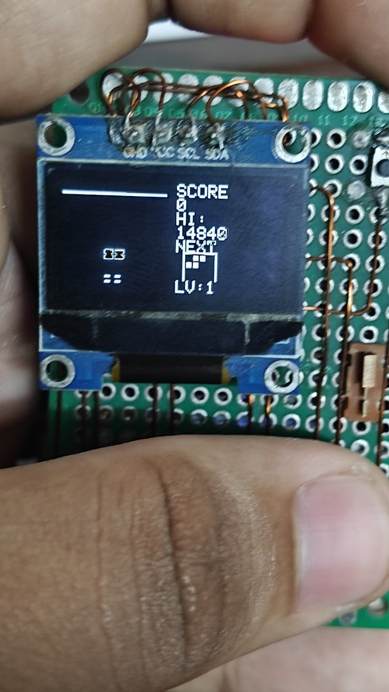<br><b>Tetris (Ghost Preview)</b></td>
    </tr>
    <tr>
      <td align="center">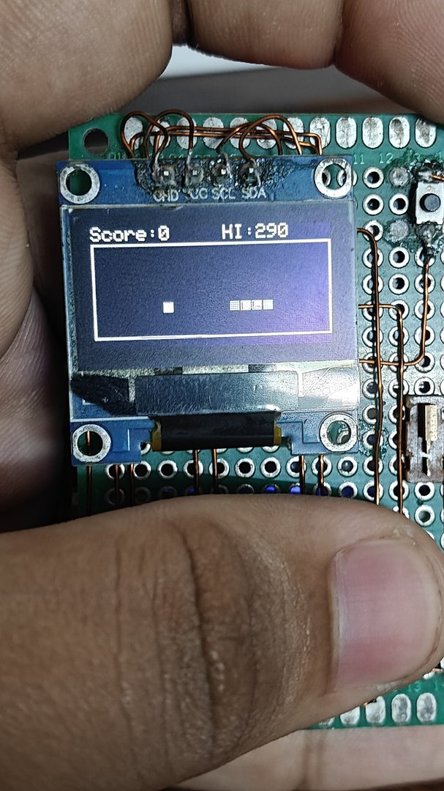<br><b>Snake Gameplay</b></td>
      <td align="center">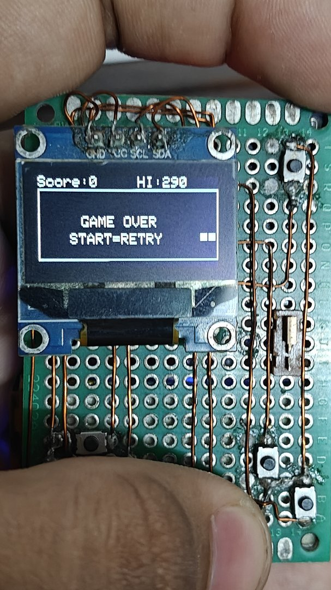<br><b>Snake Game Over</b></td>
      <td align="center">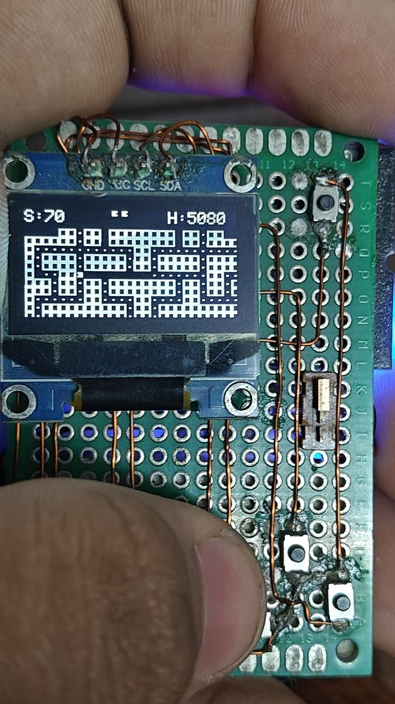<br><b>Pac-Man (4-Ghost AI)</b></td>
    </tr>
    <tr>
      <td align="center">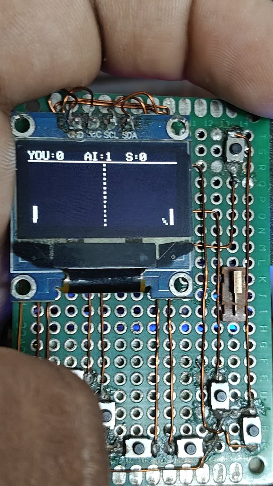<br><b>Pong vs AI</b></td>
      <td align="center">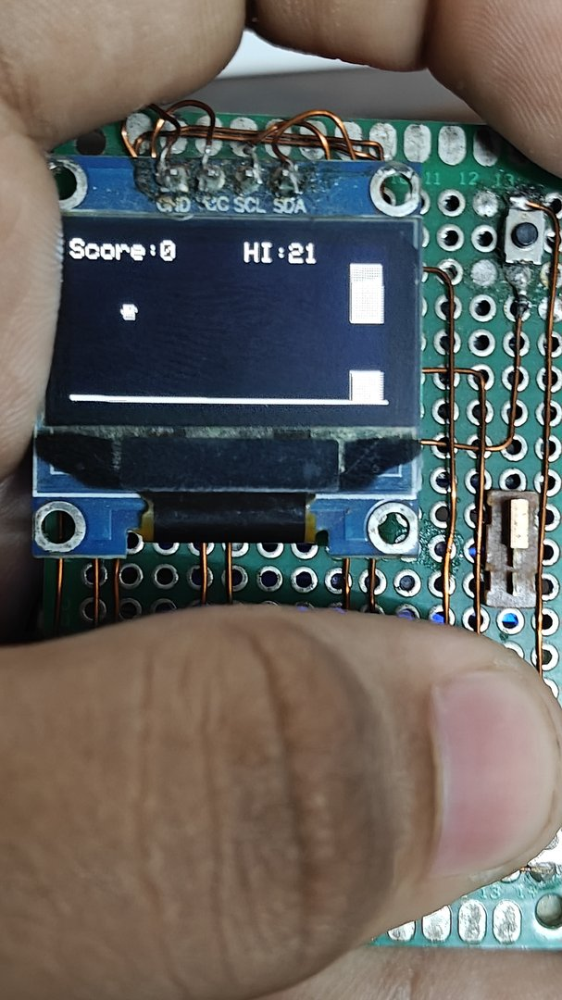<br><b>Flappy Bird</b></td>
      <td align="center">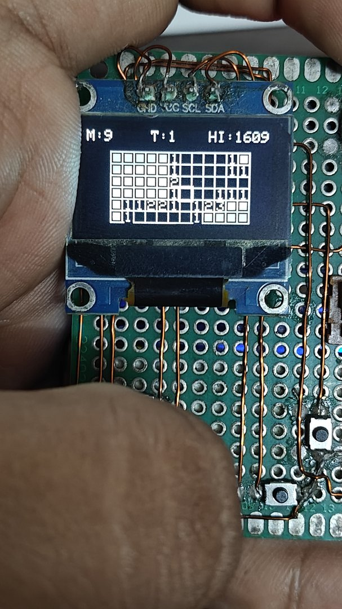<br><b>Minesweeper</b></td>
    </tr>
    <tr>
      <td align="center">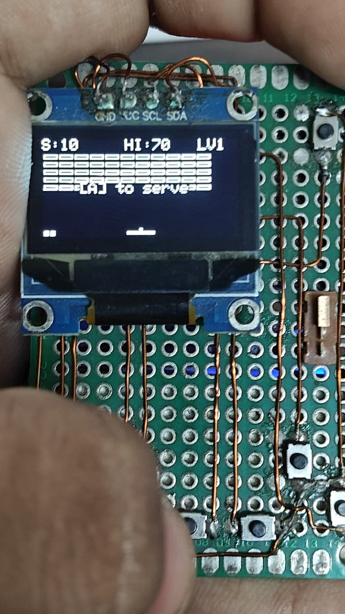<br><b>Breakout</b></td>
      <td align="center">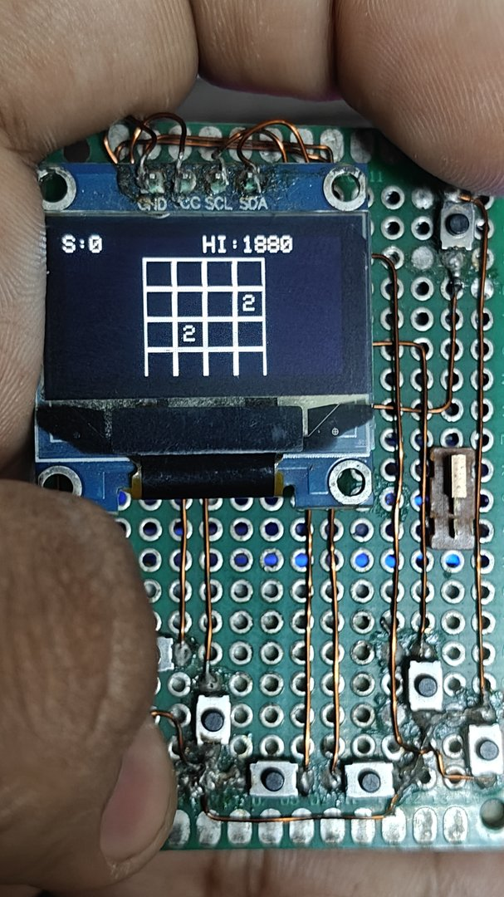<br><b>2048 Puzzle</b></td>
      <td align="center">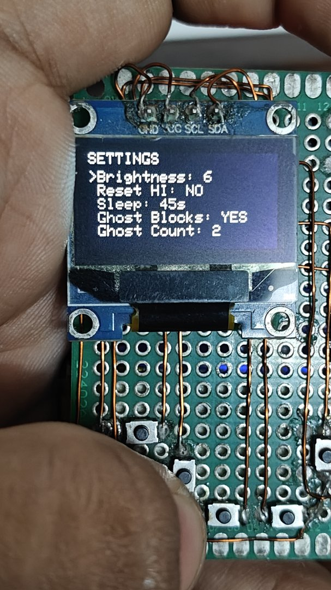<br><b>Hardware Settings</b></td>
    </tr>
  </table>
</div>

---

## 🛠️ Hardware & Pin Configuration

### Bill of Materials (BOM)

| Component | Specifications | Quantity |
| :--- | :--- | :---: |
| **Microcontroller** | ESP32-C3 SuperMini (RISC-V 160MHz, 4MB Flash, USB-C) | 1 |
| **Display** | 0.96" or 1.3" Monochrome OLED, 128&times;64, I2C SSD1306 (`0x3C`) | 1 |
| **Pushbuttons** | 6&times;6mm tactile momentary pushbuttons | 8 |
| **Power Management** | TP4056 USB-C Li-Ion charging module with 5V boost converter | 1 |
| **Battery** | 3.7V Li-Po / Li-Ion rechargeable cell (e.g. 500–1000mAh) | 1 |
| **Keep-Alive Load** | 100Ω – 150Ω resistor (connected between GPIO 5 and load pad) | 1 |
| **Power Switch** | Mini SPDT slide switch | 1 |
| **Prototyping** | Double-sided perfboard & 0.1–0.2mm enameled copper wire | — |

---

### GPIO Pinout Table

| Target Signal | ESP32-C3 Pin | Mode | Description |
| :--- | :---: | :---: | :--- |
| **I2C SDA** | `GPIO 8` | Hardware I2C | OLED Display Data Line |
| **I2C SCL** | `GPIO 9` | Hardware I2C | OLED Display Clock Line |
| **Button UP** | `GPIO 0` | `INPUT_PULLUP` | D-Pad Up / Sleep Wakeup Source |
| **Button RIGHT** | `GPIO 1` | `INPUT_PULLUP` | D-Pad Right / Sleep Wakeup Source |
| **Button LEFT** | `GPIO 2` | `INPUT_PULLUP` | D-Pad Left / Sleep Wakeup Source |
| **Button DOWN** | `GPIO 3` | `INPUT_PULLUP` | D-Pad Down / Sleep Wakeup Source |
| **Button A** | `GPIO 10` | `INPUT_PULLUP` | Action Primary / Select / Rotate / Jump |
| **Button B** | `GPIO 7` | `INPUT_PULLUP` | Action Secondary / Flag / Rotate |
| **Button START** | `GPIO 21` | `INPUT_PULLUP` | Start / Hard Drop / Serve / Retry |
| **Button SELECT** | `GPIO 20` | `INPUT_PULLUP` | Pause Menu Overlay / Back |
| **Keep-Alive Pulse** | `GPIO 5` | `INPUT` / `OUTPUT` | Active low 150ms dummy load pulse every 20s |

> [!NOTE]
> **ESP32-C3 Strapping Pin Design Considerations:**
> `GPIO 8` and `GPIO 9` function as strapping pins on the ESP32-C3 (`GPIO 8` determines SPI boot voltage/mode; `GPIO 9` controls boot strapping). Because both I2C lines are naturally pulled HIGH via pullup resistors, they ensure safe and reliable boot states every time the device powers on.

---

## 🔌 Circuit & Keep-Alive Operation

```
               +3.7V LiPo Battery
                       │
             ┌─────────┴─────────┐
             │ TP4056 + 5V Boost │
             └─────────┬─────────┘
                       │ +5V / 3.3V
                       ▼
  ┌─────────────────────────────────────────┐
  │            ESP32-C3 SuperMini           │
  │                                         │
  │  [GPIO 8] ────── SDA ──┐                │
  │  [GPIO 9] ────── SCL ──┼──> OLED (SSD1306 128x64)
  │                        │                │
  │  [GPIO 0..3] ──> D-Pad Buttons ──> GND  │
  │  [GPIO 7,10] ──> A & B Buttons ──> GND  │
  │  [GPIO 20,21] ─> Start/Select  ──> GND  │
  │                                         │
  │  [GPIO 5] ──[ 120Ω Resistor ]──> GND    │  (Pulses LOW 150ms every 20s)
  └─────────────────────────────────────────┘
```

Modern power banks and smart boost converters automatically cut power when current draw drops below ~50mA. Because the ESP32-C3 and OLED draw very little power, the firmware pulses `GPIO 5` low through a dummy load resistor for 150ms every 20 seconds, keeping the power source awake indefinitely.

---

## 🚀 Installation & Flashing Guide

### Method 1: Arduino IDE (Recommended)

1. **Install Arduino IDE:** Download and install [Arduino IDE 2.x](https://www.arduino.cc/en/software).
2. **Install ESP32 Core:**
   - Go to **File** &rarr; **Preferences**.
   - Add the following URL into **Additional Board Manager URLs**:
     ```
     https://raw.githubusercontent.com/espressif/arduino-esp32/gh-pages/package_esp32_index.json
     ```
   - Go to **Tools** &rarr; **Board** &rarr; **Boards Manager**, search for `esp32` by Espressif and install version **3.x**.
3. **Install Libraries:**
   - Go to **Tools** &rarr; **Manage Libraries...**
   - Search for and install:
     - `Adafruit SSD1306` (by Adafruit)
     - `Adafruit GFX Library` (by Adafruit)
     - `Adafruit BusIO` (by Adafruit)
4. **Open the Sketch:**
   - Clone this repository:
     ```bash
     git clone https://github.com/MRFIRE5673/ESP32-C3-Gamepad.git
     ```
   - Open `Gamepad/Gamepad.ino` in Arduino IDE. All 14 modular tabs will load automatically across the top bar.
5. **Configure Board Settings:**
   - **Board:** `ESP32C3 Dev Module`
   - **USB CDC On Boot:** `Enabled` *(Crucial: ensures USB port and flashing remain active)*
   - **Flash Size:** `4MB (32Mb)`
   - **Partition Scheme:** `Default 4MB with spiffs`
   - **Upload Speed:** `921600`
6. **Upload:** Connect your ESP32-C3 SuperMini via USB-C, select the port, and click **Upload**!

---

### Method 2: PlatformIO (VSCode / CLI)

This project includes a pre-configured `platformio.ini` with all required build flags and dependencies.

1. **Clone the repository:**
   ```bash
   git clone https://github.com/MRFIRE5673/ESP32-C3-Gamepad.git
   cd ESP32-C3-Gamepad
   ```
2. **Build and Upload:**
   ```bash
   pio run --target upload
   ```
3. **Monitor Serial (optional):**
   ```bash
   pio device monitor
   ```

---

## 📁 Repository Structure

```
ESP32-C3-Gamepad/
├── .github/
│   └── workflows/
│       └── compile.yml        # Automated CI workflow validating builds on push/PR
├── docs/
│   └── images/                # Web-optimized documentation screenshots & photos
├── Gamepad/
│   ├── Gamepad.ino            # Main sketch setup, loop, sleep & boot animation
│   ├── Config.h               # Pin assignments, NVS preferences & display setup
│   ├── Game.h                 # Abstract base class Game
│   ├── Menu.h                 # Main carousel launcher menu
│   ├── PauseMenu.h            # Universal pause/restart/quit overlay
│   ├── Tetris.h               # Tetris implementation & tetromino pieces
│   ├── Snake.h                # Snake game logic
│   ├── PacMan.h               # Pac-Man & 4-ghost AI state machine
│   ├── Pong.h                 # Pong paddle & AI prediction logic
│   ├── FlappyBird.h           # Flappy Bird physics & pipe generation
│   ├── Minesweeper.h          # Minesweeper grid & recursive reveal
│   ├── Breakout.h             # Breakout bricks & ball angle reflection
│   ├── Asteroids.h            # Asteroids vector physics & wrap-around
│   ├── Game2048.h             # 2048 4x4 sliding tile logic
│   └── SettingsGame.h         # Interactive hardware settings UI
├── .gitignore                 # Build cache, IDE & raw dump filters
├── LICENSE                    # MIT License
├── platformio.ini             # Native PlatformIO configuration
└── README.md                  # Project documentation & guides
```

---

## ❓ Troubleshooting

| Issue | Cause | Solution |
| :--- | :--- | :--- |
| **Display does not turn on** | Incorrect I2C address or loose wire | Ensure display address is `0x3C` (line in `setup()`). Verify SDA (`GPIO 8`) and SCL (`GPIO 9`) connections. |
| **Buttons not responding** | Floating inputs | Buttons must connect between the designated GPIO and **GND**. The firmware uses internal `INPUT_PULLUP`. |
| **Serial / Upload port lost** | USB CDC disabled | Hold the **BOOT** button on the SuperMini, press and release **RESET**, then release **BOOT** to force download mode. In Arduino IDE, ensure **USB CDC On Boot: Enabled** is selected. |
| **Power bank turns off after 30s** | Current draw too low | Verify the keep-alive resistor is connected between `GPIO 5` and GND/load. Ensure value is between 100Ω and 150Ω. |

---

## 📜 License

This project is licensed under the [MIT License](LICENSE) — feel free to modify, expand, build your own console, and share!
